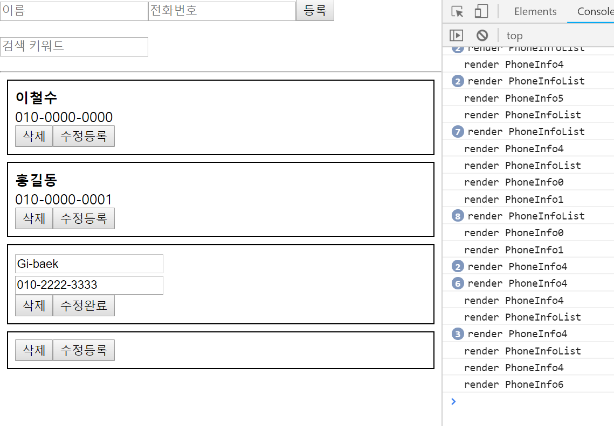
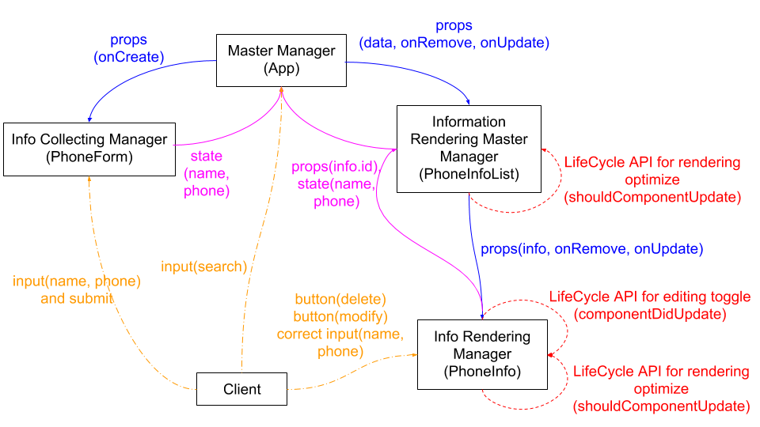

# React Practice(Phone Book)
Phonebook, from 'Client input state management' to 'Components update optimization via LifeCycle API'.

## Function
- Manage information, name and phone number
- Add one person info data
- Show information
- Search info data and show it

  

## Components Composition
### Organization Chart with Work Flow

  

### Master Manager: App.js
- Client 정보 등록 
1.PhoneForm에게 client로부터 들어온 정보 받을 바구니(onCreate) 넘기기 
2.PhoneForm이 보낸 바구니에 담긴 정보를 information배열에 추가  
- 정보전체 rendring 
3.PhoneInfoList에게 현재 information배열을 넘겨서 박스list로 만들어주라고 주문하기 
4.PhoneInfoList에게 박스list 받으면 화면에 표시하기  
- 정보 삭제 
5.PhoneInfoList에게 삭제할 id 담을 바구니(onRemvoe) 넘기기 
6.PhoneInfoList가 보낸 삭제할 id 정보로 information filtering 수행  
- 정보 수정 
7.PhoneInfoList에게 수정할 id와 data 담은 바구니(onUpdate) 넘기기 
8.PhoneInfoList가 보낸 수정할 id, data 정보로 information mapping 수행  
- client 정보 검색 요청 처리 
9.client에게 검색할 정보 요청받아서 해당 정보로 information에서 필터링 수행 
10.client 검색 수행 중에 PhoneIfoList에 fintering된 data를 넘긴다.

### Client Info Collect Manager: PhoneForm.js
- Client 정보 등록 요청 처리 
1.client input창을 화면에 띄우고 input event를 처리 
2.client가 submit하면 객체로 만들어진  input 정보를 부모컴포넌트(App)에게 반환

### Information Rendering Master Manager: PhoneInfoList.js
- 정보전체 rendering 
1.information 배열 전체를 App으로부터 받아와서 박스list로 가공하여 반환  
- 정보 박싱 
2.information 배열 내의 객체 1개씩을 PhoneInfo에 넘겨서 박스로 만들게 시키기  
- 정보 삭제 
3.App에게 받은 onRemove 바구니를 PhoneInfo에게 넘기고 id 담게하여 회수하면 App에게 다시 주기  
- 정보 수정 
4.App에게 받은 onUpdate 바구니를 PhoneInfo에게 넘기고 id, data 담게하여 회수하면 App에게 다시 주기  
- 컴포넌트 리렌더링 최적화 
5.App에게 이전, 이후에 받은 data를 비교하여 다르면 rendering 수행, 같으면 수행하지 않음

### Info Rendering Manager: PhoneInfo.js
- 정보 박싱 
1.PhoneInfoList가 넘겨준 info객체 1개를 박싱하여 반환  
- 정보 삭제 
2.PhoneInfoList에게 받은 onRemove 바구니에 사용자 요청에 의해 삭제 버튼이 눌린 정보의 id를 담아 보내기  
- client 수정요청 등록 
3.client에게 수정 정보 수집하기 
4.PhoneInfoList에게 받은 onUpdate 바구니에 client 요청에 의해 수정된 id, data를 담아 보내기  
- 컴포넌트 리렌더링 최적화 
5.edit 상태가 아니고, PhoneInfoList에게 이전/이후에 받은 info를 비교하여 다르면 rendering 수행, 같으면 수행하지 않음

## Trouble to Shoot
- PhoneInfoList: shouldComponentUpdate 
검색결과가 이전에도 없고 이후에도 없으면 둘 다 비어있는 배열이 오는 것인데 이 경우 서로 같지 않은 데이터로 판단하고 return true가 되어
계속 검색결과가 없어도 PhoneInfoList의 render가 발생한다(PhoneInfo의 render는 발생하지 않는다).  
- PhoneForm: form submit 
아무 정보를 입력하지 않고 등록버튼을 눌러도 정보가 없는 상태로 등록된다.

## Summary
- Make reusable component
- Props are conveyed data from the parent component
- A state is local data of the component
- A component does rerendering when props or state is changed
- Set a logic before or after component mount, update, and unmount, or can prevent rerendering via LifeCycle API

## Reference
React tutorial - Velopert Blog [누구든지 하는 리액트](https://velopert.com/3613)

